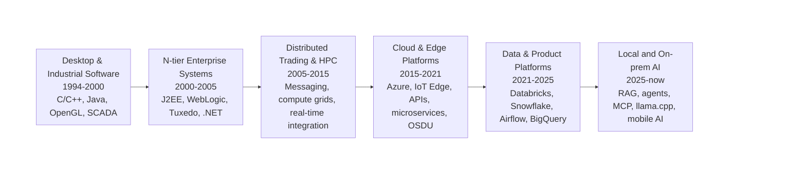

# Dania Kodeih

### Career Technologist · Enterprise Architect · Product Executive · Hands-on Builder

**From desktop and industrial software to N-tier systems, distributed computing, cloud platforms, edge architecture, and local AI.**

## The through-line

I’m a career technologist with more than 25 years across software engineering, enterprise architecture, technology delivery, and product leadership.

Most recently, I was a product management executive at a large fintech. Earlier, at Microsoft, I helped lead architecture and delivery work for OSDU, an open-source, multicloud data platform for the energy industry. My public contributions included ingestion architecture, workflow orchestration, microservices principles, and cross-cloud platform requirements.

I now build hands-on AI and data prototypes spanning local AI, agent workflows, mobile applications, cloud and data platforms, and native model integration. I work across the full path from product strategy and architecture to implementation.

My career has followed the architecture pendulum from software running close to the user and the physical world, through increasingly distributed enterprise and cloud platforms, and now back toward privacy-first systems where models and data can run locally, on-premises, or at the edge.

> **Desktop → N-tier → distributed systems → cloud → edge → local AI**
>
> The technologies changed. The recurring challenge did not: place data and compute where performance, resilience, privacy, and economics require them.

## Code to boardroom

<table>
<tr>
<td width="33%" valign="top">

### Build

Prototypes and production systems across C/C++, Java, .NET, Python, Kotlin, SQL, mobile, data, and AI.

</td>
<td width="33%" valign="top">

### Architect

Target-state platforms, APIs, event-driven systems, enterprise integration, data pipelines, HPC, cloud, edge, and local-first systems.

</td>
<td width="33%" valign="top">

### Lead

Product portfolios, major transformation programs, engineering teams, partner ecosystems, governance, and delivery from concept through adoption.

</td>
</tr>
</table>

## Selected technology journey

### Early software: desktop, visualization, and the physical world

I began as a software developer building C/C++ and Java systems, including SCADA-based outage management, 2D utility visualization, and OpenGL/OpenInventor 3D visualization for aircraft-engine configuration management.

### Enterprise systems: client/server to N-tier

I helped organizations move from AS/400 and legacy client/server applications into distributed J2EE and .NET architectures. The work included application frameworks, security and user context, middleware, transactions, object-relational mapping, and interoperability across Java, COM, RMI, and JNI.

### Distributed computing: trading, messaging, and HPC

In energy trading, I designed and helped build highly integrated, event-driven platforms connecting trading, scheduling, settlement, invoicing, exchanges, market-data providers, and regulatory systems. I also developed the prototype for a distributed valuation grid that reduced a portfolio calculation from more than three hours to under twenty minutes.

### Cloud and edge: platforms beyond the data center

At Microsoft, I guided enterprise Azure adoption, application modernization, industrial IoT, sensor-to-cloud architectures, Azure IoT Edge, microservices, and HPC. I later led Microsoft’s architecture and delivery work for OSDU, a multi-company, multi-cloud subsurface data platform.

### Data products: architecture, product, and delivery

At MSCI, I led ESG and Climate platform transformation across product, architecture, engineering, and program delivery, modernizing data and processing platforms using technologies including Databricks, Snowflake, Airflow, BigQuery, Azure, and Google Cloud.

### Current chapter: local AI and sovereign systems

Through Nuralik, I’m returning to hands-on building while applying an enterprise architecture lens to AI systems. My current work includes:

* Local and on-prem LLM inference on constrained hardware
* Retrieval-augmented generation and local knowledge architectures
* Agent workflows, tool calling, and Model Context Protocol integration
* Quantized-model evaluation, memory constraints, latency, and inference trade-offs
* Python, SQL, Docker, data pipelines, DuckDB, Parquet, and relational storage
* Ollama, Open WebUI, llama.cpp, and GPU-aware local model deployment
* Kotlin Multiplatform, Jetpack Compose, SQLDelight, JNI, and experimental mobile inference
* Privacy-first and air-gapped architecture patterns for regulated or sensitive environments

## Featured public project

### [Silver Turtle](https://github.com/straycomet/silverturtle)

A privacy-oriented mobile AI companion prototype for older adults. It explores accessible mobile UX, Kotlin Multiplatform, Jetpack Compose, SQLDelight, persistent user context, agent routing, MCP connectivity, and experimental on-device inference through MLC and `llama.cpp`/JNI.

The project is intentionally presented as an engineering and architecture prototype. Active development has shifted to a separate AI and data platform that is currently private.

## Technology landscape

**Languages and development**
C · C++ · Java · C#/.NET · Python · Kotlin · SQL · JavaScript/TypeScript

**Architecture and integration**
Distributed systems · Event-driven architecture · APIs · Messaging · Microservices · Enterprise integration · HPC · IoT · Edge computing

**Data and cloud**
Azure · Google Cloud · Kubernetes · Databricks · Snowflake · Airflow · BigQuery · Relational databases · Batch and streaming pipelines

**AI systems**
Local LLM inference · RAG · Agents · Tool calling · MCP · Ollama · Open WebUI · llama.cpp · Quantization · Model and hardware benchmarking

## What I bring

I’m most useful where strategy and implementation must stay connected: defining the target state, understanding the engineering trade-offs, organizing delivery, and going deep enough into the technology to know what is real.

That can mean an enterprise transformation roadmap, a data and AI platform architecture, a working proof of concept, or debugging the boundary between an application, its infrastructure, and the model it depends on.

---

[LinkedIn](https://www.linkedin.com/in/dkodeih) · [Email](mailto:dkodeih@nuralik.com) · [Silver Turtle](https://github.com/straycomet/silverturtle)

## License

Copyright © 2026 Dania Kodeih. All rights reserved.

The source code is publicly visible for portfolio and evaluation
purposes only. No license is granted for reuse, modification,
distribution, deployment, or commercial use.

